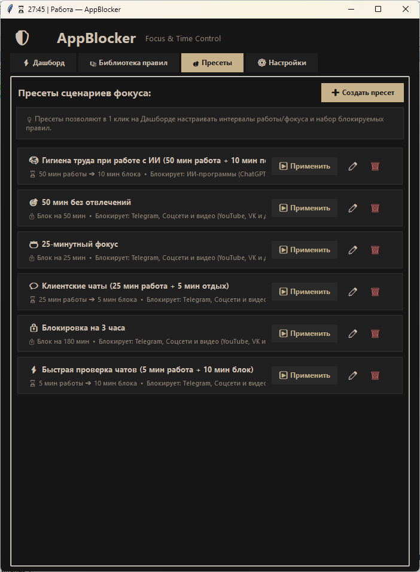
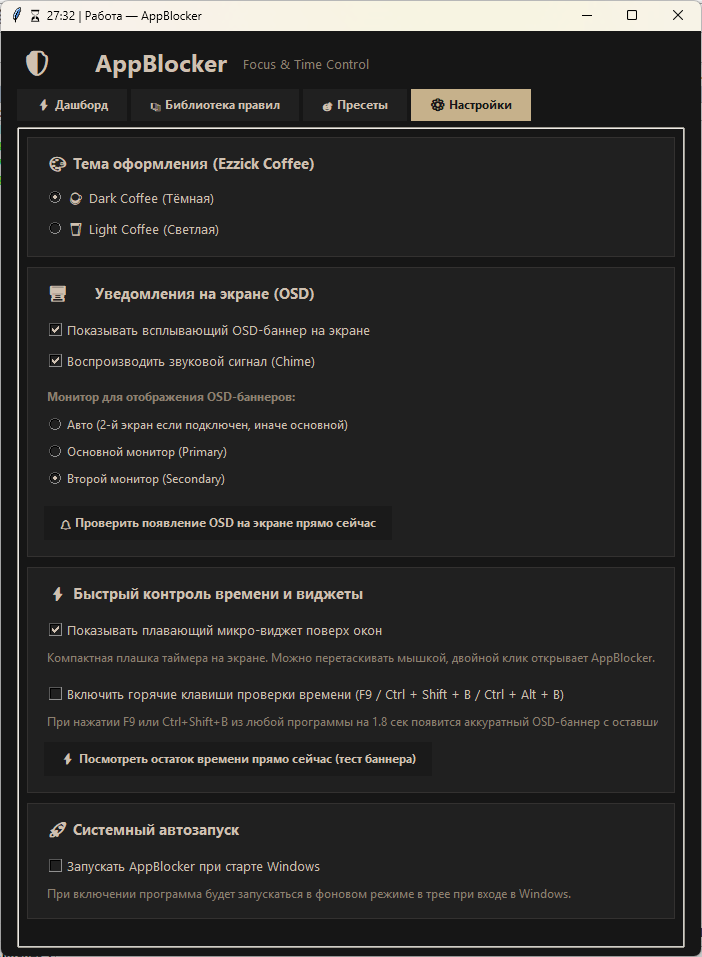

# ☕ AppBlocker & Focus Tools

Автономная настольная система контроля экранного времени и блокировки отвлекающих факторов (Telegram, Discord, Steam, браузерные вкладки YouTube/VK/Pinterest/соцсетей, ИИ-приложения) для Windows с графическим интерфейсом в стиле **Ezzick Coffee Theme** (тёмная и светлая кофейные темы).

Разработано **без сторонних pip-зависимостей** — только стандартная библиотека Python и чистый Win32 API (`ctypes`).

<p align="center">
  
  
  
  
</p>

<p align="center">
  
</p>

---

## ⬇️ Скачать

| Для пользователей (готовый exe) | Для разработчиков (исходный код) |
|---|---|
| [Скачать AppBlocker v2.1 (exe)](dist/AppBlocker_v2.1.exe) | [Исходный код (Python)](src/) |

> **Релизы:** Все версии также доступны на странице [Releases](https://github.com/ezzick/appblocker-windows/releases) — там можно скачать любую сборку и посмотреть changelog.

---

## 🚀 Быстрый старт

### Для обычных пользователей
1. Скачай `AppBlocker_v2.1.exe` из раздела **⬇️ Скачать** выше.
2. Запусти — приложение готово к работе. Ничего устанавливать не нужно.

### Для разработчиков
```bash
git clone https://github.com/ezzick/appblocker-windows.git
cd AppBlocker
python src/AppBlocker.pyw
```
> Никаких `pip install` — проект использует **только стандартную библиотеку Python**.

---

## 🎨 Цветовая палитра (Ezzick Coffee Theme)

Приложение поддерживает мгновенное переключение между двумя кофейными темами в настройках:

| Элемент | ☕ Тёмная кофейная (Dark Coffee) | 🥛 Светлая кофейная (Light Coffee) |
| :--- | :---: | :---: |
| **Основной фон окна** | `#161616` (Deep Dark) | `#ece0d1` (Soft Latte) |
| **Фон карточек и списков** | `#202020` (Dark Card) | `#dfd3c3` (Warm Cream Card) |
| **Фон полей ввода** | `#1a1a1a` (Base Input) | `#f4ede4` (Light Sand) |
| **Главный акцент (Accent)** | `#c6b18b` (Coffee Cream) | `#967259` (Warm Coffee) |
| **Текст на акценте** | `#161616` (High-contrast Dark) | `#ffffff` (Crisp White) |
| **Основной текст** | `#cfc0b0` (Warm Ivory) | `#3c2f2f` (Deep Espresso) |
| **Приглушенный текст** | `#8d8070` (Muted Coffee) | `#7a6b5d` (Warm Taupe) |
| **Границы блоков** | `#333130` | `#c8b9a6` |
| **Акцент предупреждений / Фаза 1** | `#c2854b` (Warm Caramel) | `#b36b2b` |
| **Акцент блокировки / Ошибки** | `#b55a5a` (Soft Coral) | `#a74141` |

---

## ✨ Ключевые возможности

### 1. ⚡ Интерактивный дашборд и сохранение сессий (Persistent Sessions)
- **Управление сессией в 1 клик:** Кнопка `▶ Запустить сессию` / `⏹ Остановить этап «До блокировки»` / `⏹ Остановить блокировку` с динамической цветовой индикацией.
- **Сохранение активной сессии:** При случайном закрытии приложения или перезагрузке сессия **не сбрасывается**. При повторном открытии программа автоматически определяет оставшееся время и бесшовно возобновляет работу таймера и блокировки.
- **Индикация фаз и обратный отсчет:**
  - `⏳ ДО БЛОКИРОВКИ` (оранжевый статус) — время на завершение текущих задач и закрытие переписок.
  - `🔒 ИДЁТ БЛОКИРОВКА` (акцентный статус) — активный режим блокировки с принудительным закрытием отвлекающих процессов.
  - Высокоточный таймер `ММ:СС` и анимированный прогресс-бар в акцентном кофейном цвете.
- **Интуитивная карточка настройки:**
  - Динамическая сводка параметров сессии оранжевым шрифтом с фиксированной высотой (2 строки) против скачков интерфейса.
  - Выбор блокируемых приложений в выровненной 2-колоночной сетке чекбоксов.
  - Раздельные поля времени в 2 строки: `До блокировки: N минут` и `Блокировка на: M минут`.
- **Быстрые пресеты и быстрое сохранение:**
  - Список готовых шаблонов с элегантной индикацией активного выбора (акцентная точка `●` и мягкая кофейная подсветка).
  - Кнопка **`💾 Сохранить как пресет`** прямо на Дашборде для сохранения текущей комбинации времени и приложений в новый сценарий.

<p align="center">
  
</p>

### 2. ⚡ Быстрая проверка времени (Quick Time Peek) без отвлекающих окон
- **🏷️ Динамический заголовок в панели задач:** Пока окно свёрнуто, на кнопке панели задач и в превью окон отображается точный таймер и текущая фаза (`⏳ 01:21 | До блокировки — AppBlocker` или `🔒 09:45 | Блокировка — AppBlocker`). Достаточно просто бросить взгляд вниз экрана.
- **⌨️ Глобальный хоткей проверки времени (`F9` / `Ctrl + Shift + B` / `Ctrl + Alt + B`):** При нажатии комбинации из любой программы (IDE, браузер, полноэкранный редактор) на **1.8 секунды** появляется аккуратный полупрозрачный OSD-баннер со статусом и оставшимся временем — без звука, без перехвата фокуса ввода и с плавным авто-скрытием.
- **📌 Плавающий микро-виджет (Floating Pill):** Компактная плашка `124×32 px` поверх окон в цветах Ezzick Coffee (`⏳ 01:21` / `🔒 09:45`). Свободно перетаскивается мышкой в любое удобное место экрана (позиция сохраняется), включается/отключается в 1 клик прямо на Дашборде, а двойной клик по ней разворачивает полное окно приложения.

### 3. 🔔 Нативная интеграция с системным треем Windows (System Tray)
- **Фоновый режим:** При нажатии на крестик `[X]` окно аккуратно сворачивается в область уведомлений панели задач, продолжая контроль сессии.
- **Фирменная иконка:** Минималистичная иконка щита в стиле Lucide (`assets/app_icon.ico`) в трее и заголовке окна.
- **Динамический тултип:** При наведении мыши отображает текущий статус и оставшиеся минуты/секунды (`AppBlocker: 24:15 (До блокировки)` / `AppBlocker: 04:30 (Блокировка)`).
- **Контекстное меню (ПКМ):**
  - `⚡ Открыть AppBlocker` — мгновенное восстановление окна на передний план.
  - `▶ Запустить / ⏹ Остановить блокировку` — быстрое переключение без открытия окна.
  - `❌ Выход из приложения` — полное завершение работы с сохранением состояния.
- **Активация в 1 клик:** Клик (ЛКМ) по иконке в трее мгновенно возвращает окно на экран.

### 4. 📚 Каталог правил и Window Picker
- **Предустановленные правила:** Telegram Desktop, ИИ-программы (ChatGPT, Claude, Cursor, Windsurf и др.), ИИ-сайты, вкладки браузеров (Chrome, Edge, Brave, Yandex, Opera, Firefox), Discord, Steam и др.
- **Добавление в 1 клик (Window Picker):** Интерактивный захват заголовка и имени процесса любого активного окна без ручного ввода путей к `.exe`.
- **Три режима блокировки:**
  - **🗕 Сворачивание и удержание свёрнутым (`SW_MINIMIZE`):** Специальный бережный режим для тяжёлых десктопных ИИ-приложений (ChatGPT, Claude, Cursor, Windsurf, LM Studio и др.). Приложения **не закрываются и не убиваются**, их контекст, чаты, запущенные локальные модели и открытые файлы полностью сохраняются в оперативной памяти, но развернуть их во время блокировки невозможно (при попытке развернуть окно мгновенно сворачивается обратно).
  - **📦 Полное закрытие окна/процесса (`WM_CLOSE`):** Для мессенджеров, игр и сторонних отвлекающих программ.
  - **🌐 Умное закрытие вкладок (`Ctrl+W`):** Закрывает только отвлекающие вкладки в браузерах по ключевым словам в заголовке (`YouTube`, `VK`, `Pinterest`, `Twitter/X`, ИИ-сайты и др.), не закрывая рабочие документы.
- **Подсказки для белых и черных списков:** Наглядные примеры заполнения исключений прямо в диалоге создания правила.

<p align="center">
  
</p>

### 5. 🎯 Управление библиотекой пресетов (Вкладка «Пресеты»)
- **Собственные сценарии:** Создание, редактирование, дублирование и удаление пользовательских пресетов.
- **Модальный редактор `PresetDialog`:** Настройка названия с эмодзи, описания, минут до блокировки, минут блокировки и персонального набора активных правил.
- **Мгновенное применение `[▶ Применить]`:** Загрузка всех параметров пресета на Дашборд в 1 клик с автоматическим переходом на главный экран.

<p align="center">
  
</p>

### 6. 🖥️ OSD-уведомления и мультимониторность
- **Всплывающие информационные баннеры** в палитре выбранной кофейной темы (Dark/Light).
- **Без перехвата фокуса ввода:** Создаются со стилями `WS_EX_NOACTIVATE` и `SW_SHOWNOACTIVATE`, не сбивая набор текста и фокус активных окон.
- **Приятный звуковой сигнал (Chime)** при появлении оповещения.
- **Выбор монитора:** Автоматический (вывод на второй монитор при наличии), основной монитор или конкретный вторичный дисплей.
- **Кнопка проверки:** Тестовый вызов OSD прямо из настроек для быстрой проверки позиции.

### 7. ⚙️ Интеграция с Windows и надежность
- **Изоляция данных в `%APPDATA%\AppBlocker\`:** Полная совместимость с установкой в `C:\Program Files\AppBlocker\` без требований прав администратора.
- **Защита от дубликатов (Single Instance Mutex + Broadcast):** Предотвращает запуск второй копии, автоматически разворачивая уже работающее окно на передний план.
- **Автозагрузка:** Опциональный фоновый запуск при входе в Windows через безопасную ветку реестра (`HKCU\Software\Microsoft\Windows\CurrentVersion\Run`).
- **Запоминание геометрии:** Автоматическое сохранение размера и положения окна на экране.
- **Ротируемое файловое логирование:** Автоматическое ведение логов в `%APPDATA%\AppBlocker\logs\appblocker.log` (до 5 архивов по 2 МБ) для диагностики.

<p align="center">
  
</p>

---

## ⚡ Готовые пресеты

| Пресет | До блокировки | Блокировка | Назначение |
| :--- | :---: | :---: | :--- |
| 🧠 **Гигиена труда при работе с ИИ** | 50 мин | 10 мин | 50 мин работы с ИИ-программами, затем 10 мин на осмысление и перерыв |
| 🎯 **50 мин без отвлечений** | 0 мин | 50 мин | Блокировка всех мессенджеров, вкладок и игр на 50 минут |
| ☕ **25-минутный фокус** | 0 мин | 25 мин | Классический помодоро-спринт с полной изоляцией |
| 💬 **Клиентские чаты** | 25 мин | 5 мин | 25 мин активных ответов в чатах + 5 мин паузы |
| 🔒 **Блокировка на 3 часа** | 0 мин | 180 мин | Длительная сессия блокировки для сложных задач |
| ⚡ **Быстрая проверка чатов** | 5 мин | 10 мин | 5 мин на срочные ответы + 10 мин блокировки |

---

## 📁 Структура проекта

```
AppBlocker/
├── src/                         # Исходный код
│   ├── AppBlocker.pyw           # Главная точка входа GUI (без консоли через pythonw)
│   ├── app_gui.py               # Графический интерфейс на Tkinter
│   ├── config_manager.py        # Управление конфигурацией, правилами, пресетами
│   └── blocker_utils.py         # Движок Win32 API (ctypes), трей, OSD, сессии
├── assets/
│   └── app_icon.ico             # Фирменная мультиформатная иконка
├── images/                      # Скриншоты интерфейса
│   ├── Дашборд. До блокировки.png
│   ├── Дашборд. Во время блокировки.png
│   ├── Библиотека правил.png
│   ├── Пресеты.png
│   └── Настройки.png
├── tests/                       # Автоматические unit-тесты
│   ├── run_all_tests.py         # Единый раннер тестов
│   ├── test_config_manager.py   # Тесты конфигурации и пресетов
│   ├── test_app_rules.py        # Тесты правил и Fail-Fast логики
│   └── test_session_controller.py # Тесты контроллера сессий и ассетов
├── dist/                        # Готовые exe-сборки (релизные версии)
│   └── AppBlocker_v2.1.exe
├── .gitignore
├── LICENSE
└── README.md
```

### 💾 Расположение пользовательских данных:
Все данные пользователя изолированы в каталоге пользователя Windows:
- **Конфигурация:** `%APPDATA%\AppBlocker\config.json`
- **Состояние активной сессии:** `%APPDATA%\AppBlocker\session_state.json`
- **Ротируемые логи:** `%APPDATA%\AppBlocker\logs\appblocker.log` (до 5 файлов по 2 МБ)

---

## 🧪 Запуск и тестирование

### Запуск приложения (GUI):
```bash
python src/AppBlocker.pyw
```

### Запуск автоматических unit-тестов:
```bash
python tests/run_all_tests.py
```

